# Laporan Praktikum Big Data
Repository ini berisi rangkaian praktikum Big Data yang mencakup penyimpanan terdistribusi (HDFS, MongoDB, Cassandra), pemrosesan data skala besar menggunakan MapReduce dan Apache Spark, pembangunan pipeline ingestion dengan Sqoop, Flume, dan Kafka, serta proses pra-pemrosesan dan feature engineering menggunakan PySpark sebagai dasar pemahaman ekosistem Big Data secara menyeluruh.

<br> 

| Variable           |             Isi             |
| -------------------|-----------------------------|
| **Nama**           |     fakhri afif muhaimin    |
| **NIM**            |          312310632          |
| **Mata Kuliah**    |           Big Data          |
| **Dosen Pengampu** | Agung Nugroho S.Kom., M.Kom.|

<br>

## Praktikum 1
Pastikan perangkat lunak berikut sudah terpasang:

*   **Java 8+**: Diperlukan untuk komponen Hadoop/HDFS.
*   **Git**: Diperlukan untuk mengkloning dataset atau repositori kode.
*   **Docker** (Opsional): Mempermudah proses instalasi dan manajemen dependensi.

### Bagian 1 Praktikum HDFS 
1. **Membuat direktori praktikum di HDFS**
   ```bash
   hdfs dfs -mkdir /praktikum
   ```
   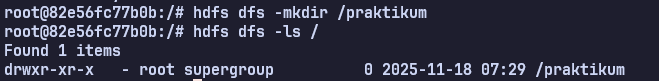 <br> <br>

2. **Membuat sebuah file beserta dummy data pada file datasest.csv**
   ```bash
    cat > dataset.csv << EOF
    nim,nama,jurusan,ipk
    12345,Andi,Informatika,3.75
    12346,Budi,Sistem Informasi,3.50
    12347,Citra,Teknik Komputer,3.85
    12348,Doni,Informatika,3.60
    12349,Eka,Sistem Informasi,3.90
    12350,Fani,Teknik Komputer,3.45
    12351,Gita,Informatika,3.70
    12352,Hadi,Sistem Informasi,3.55
    EOF
   ```
   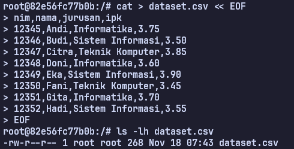 <br> <br>

3. **Mengunggah dataset ke HDFS & Verfikasi isi direktori**
   ```bash
   ## Perintah untuk upload dataset ke hdfs
   hdfs dfs -put dataset.csv /praktikum/

   ## Perintah untuk memeriksa isi dari direktori praktikum
   hdfs dfs -ls /praktikum/
   ```
   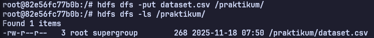 <br> <br>

4. **Membaca isi dataset langsung dari HDFS**
   ```bash
   hdfs dfs -cat /praktikum/dataset.csv
   ```
   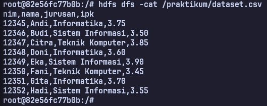 <br> <br>
   

#### Latihan: coba upload file besar (>100MB) dan periksa apakah file tersebut terpecah menjadi blok-blok kecil di HDFS.
1. **Membuat file dummy 150MB lalu upload file besar tersebut ke dalam direktori praktikum**
   ```bash
   # Buat file dummy 150MB
   dd if=/dev/zero of=bigfile.dat bs=1M count=150
   
   # Upload ke HDFS
   hdfs dfs -put bigfile.dat /praktikum/
   ```
   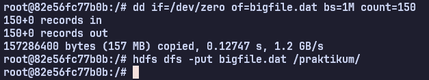 <br> <br>

2. **Periksa detail file telah terpecah menjadi beberapa blok**
   ```bash
   hdfs fsck /praktikum/bigfile.dat -files -blocks -locations
   ```
   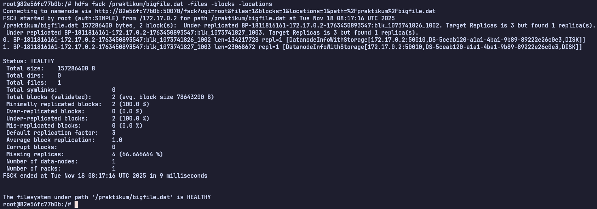 <br> <br>

**Penjelasan Singkat**
File bigfile.dat berukuran 150MB (157,286,400 bytes) dipecah oleh HDFS menjadi 2 blok dengan ukuran rata-rata sekitar 78.6MB per blok, karena HDFS secara otomatis memecah file besar menjadi blok-blok dengan ukuran default (biasanya 128MB atau lebih kecil tergantung konfigurasi) untuk memudahkan penyimpanan terdistribusi, paralelisme pemrosesan, dan fault tolerance dalam sistem big data.

<br> <br>


### Bagian 2 Praktikum MongoDB
1. **Memilih database yang ingin digunakan**
   ```mongodb
   use praktikum
   ```
   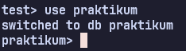 <br>
   Pastikan database otomatis dibuat saat perintah insert pertama dijalankan. <br> <br>

2. **Menambahkan data pada tabel mahasiswa**
   ```mongodb
   db.mahasiswa.insertOne({ nim: "312310617", nama: "Fadil", jurusan: "Informatika" })
   ```
   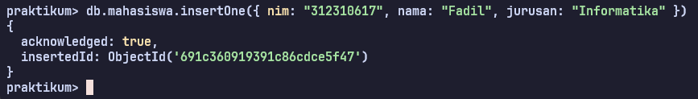 <br> <br>

3. **Memeriksa data yang sudah inputkan sebelumnya**
   ```mongodb
   db.mahasiswa.find()
   ```
   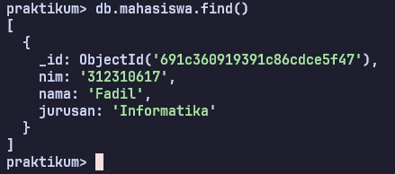 <br> <br>

4. **Menambahkan data sekaligus banyak & Periksa data**
   ```mongodb
   db.mahasiswa.insertMany([
    { nim: "31231022", nama: "Budi", jurusan: "Sistem Informasi" },
    { nim: "31231023", nama: "Andi", jurusan: "Sistem Informasi" },
    { nim: "31231024", nama: "Cihuy", jurusan: "Teknik Mesin" },
    { nim: "31231025", nama: "Tomas", jurusan: "Arsitektur" }
   ])
   ```
   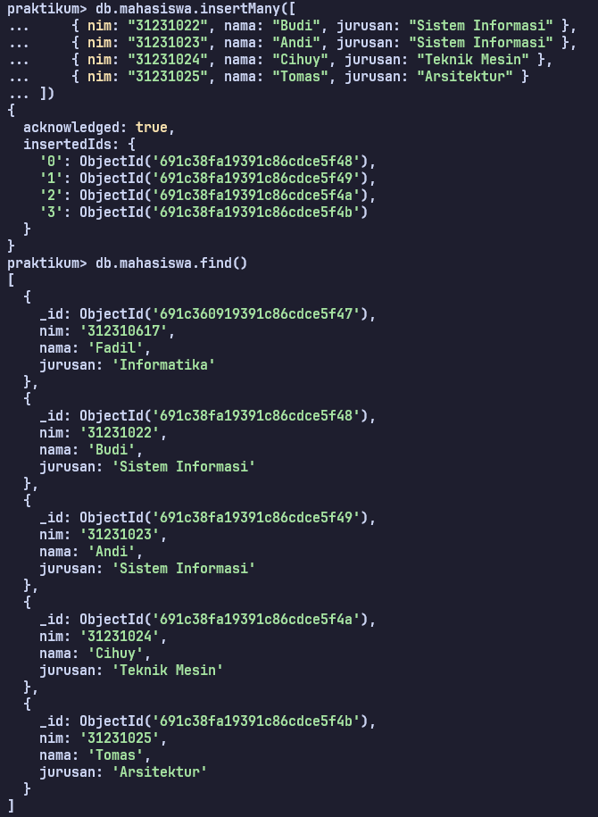 <br> <br>

5. **Mencari data menggunakan query filter**
   ```mongodb
   ## Query filter bisa disesuaikan masing masing
   db.mahasiswa.find({ jurusan: "Informatika" })
   ```
   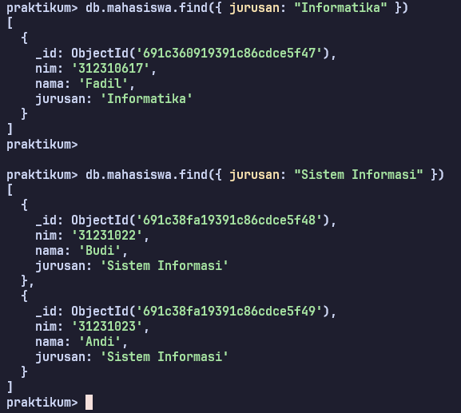 <br> <br>

6. **Membuat indeks pada kolom NIM agar query cepat**
   ```mongodb
   db.
   ```
   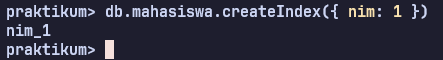 <br> <br>

7. **Menampilkan data secara urut berdasarkan nama (A-Z)**
   ```mongodb
   db.mahasiswa.find().sort({ nama: 1 })
   ```
   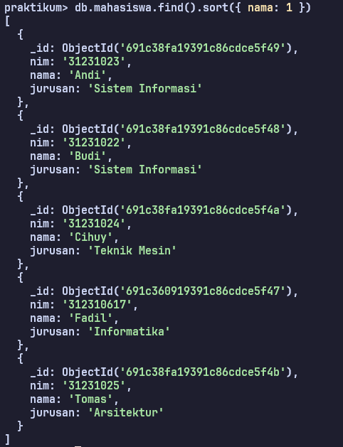 <br> <br>


#### Latihan: coba simpan data dalam bentuk nested JSON (misalnya biodata dengan alamat & kontak).
1. **Membuat data dalam bentuk nested JSON**
   ```mongodb
   db.mahasiswa.insertOne({
    nim: "312310617",
    nama: "Fadil",
    jurusan: "Informatika",
    alamat: {
        jalan: "Jl. Sudirman No. 45",
        kota: "Jakarta",
        kodePos: "12190"
    },
    kontak: {
        email: "fadil@email.com",
        telepon: "08123456789"
    },
    nilai: [
        { matkul: "Cybersecurity", skor: 95 },
        { matkul: "Big Data", skor: 90 },
        { matkul: "Web Programming", skor: 88 }
    ]
   })
   ```
   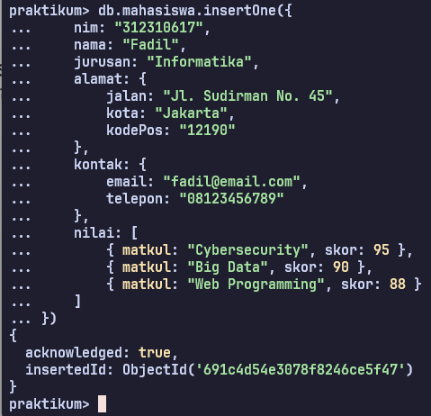 <br> <br>

2. **Menampilkan data yang telah dibuat dalam bentuk nested json dengan menggunakan query nested field**
   ```mongodb
   db.mahasiswa.find({ "alamat.kota": "Jakarta" })
   ```
   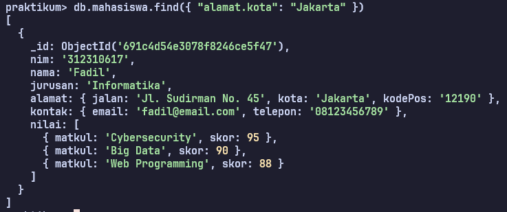

   <br> <br>


### Bagian 3 Praktikum Cassandra
1. **Membuat keyspace praktikum**
   ```cassandra
   CREATE KEYSPACE praktikum
   WITH replication = {'class': 'SimpleStrategy', 'replication_factor': 1};

   ## Gunakan keyspace
   USE praktikum;
   ```
   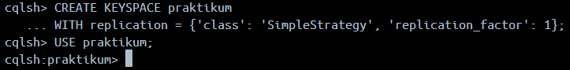 <br> <br>

2. **Membuat tabel mahasiswa didalam keyspace praktikum**
   ```cassandra
   CREATE TABLE mahasiswa (
    nim text PRIMARY KEY,
    nama text,
    jurusan text
   );
   ```
   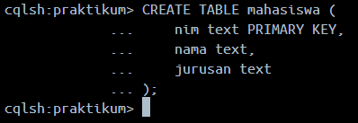 <br> <br>

3. **Memasukkan data pada tabel mahasiswa**
   ```cassandra
   INSERT INTO mahasiswa (nim, nama, jurusan)
   VALUES ('12345', 'Budi', 'Informatika');

   ## Tampilkan data
   SELECT * FROM mahasiswa;
   ```
   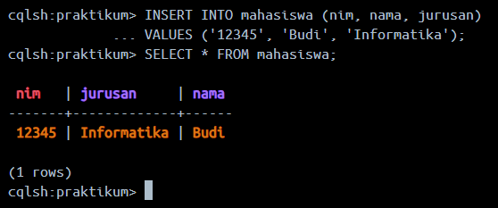 <br> <br>

4. **Memasukkan banyak data dan tampilkan berdasarkan filter**
   ```cassandra
   INSERT INTO mahasiswa (nim, nama, jurusan) 
   VALUES ('12346', 'Citra', 'Sistem Informasi');
   
   INSERT INTO mahasiswa (nim, nama, jurusan) 
   VALUES ('12347', 'Dewi', 'Teknik Komputer');
   
   INSERT INTO mahasiswa (nim, nama, jurusan) 
   VALUES ('12348', 'Eko', 'Informatika');

   ## Filter Data
   SELECT * FROM mahasiswa WHERE jurusan='Informatika' ALLOW FILTERING;

   ## Lalu Ubah replication factor (untuk cluster)
   ALTER KEYSPACE praktikum WITH replication =
   {'class':'SimpleStrategy','replication_factor':3};
   ```
   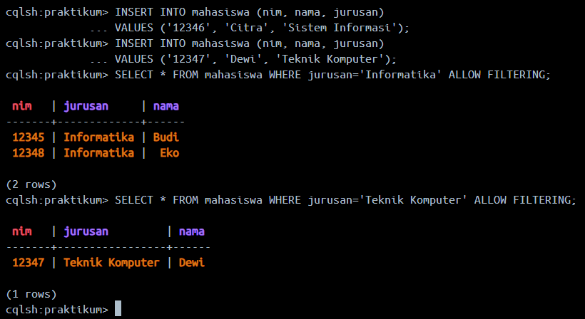 <br> <br>


   #### Latihan: coba jalankan Cassandra dalam 2 node cluster menggunakan Docker Compose dan amati distribusi data.
1. **Pertama tama kita membuat skrip nya terlbih dahulu didalam file docker-compose.yml (yang sudah terlampir). Setelah itu periksa hasil skrip tadi dengan perintah:**
   ```cassandra
   docker-compose ps
   ```
   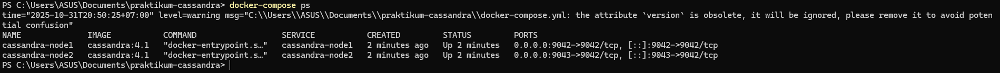 <br> <br>

2. **Lalu jalankan sesi shell CQL interaktif**
   ```cassandra
   docker exec -it cassandra-node1 cqlsh
   ```
   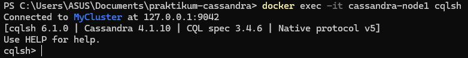 <br> <br>

3. **Membuat keyspace latihan & membuat tabel users**
   ```cassandra
   CREATE KEYSPACE latihan
   WITH REPLICATION = {'class': 'SimpleStrategy', 'replication_factor': 2};
   cqlsh> USE latihan;
   cqlsh:latihan> CREATE TABLE users (
   id int PRIMARY KEY,
   name text
   );
   ```
   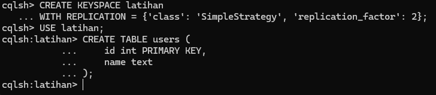 <br> <br>

4. **Masukkan data**
   ```cassandra
   cqlsh:latihan> INSERT INTO users (id, name) VALUES (1, 'Fadil');
   cqlsh:latihan> SELECT * FROM users;
   ```
   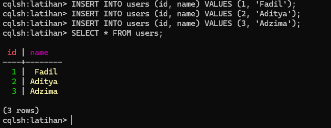 <br> <br>

5. **Menampilkan status keseluruhan kluster Apache Cassandraa**
   ```cassandra
   docker exec -it cassandra-node1 nodetool status
   ```
   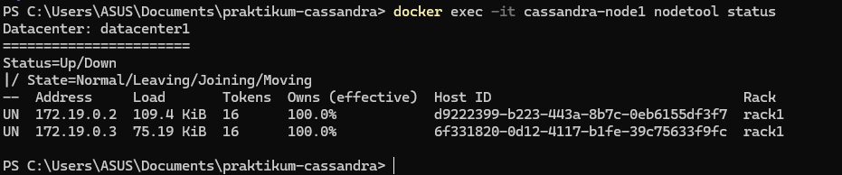 <br>
   Perintah nodetool status memastikan cluster udah stabil (UN) dan ada dua node yang terdaftar, berarti cluster 2-node udah up.


<br> <br> <br>


## Praktikum 2 Pemrosesan Data Besar
**Kasus Studi: Word Count (Menghitung Frekuensi Kata)** <br>

**Prasyarat Lingkungan**
*   Kluster Hadoop (atau single-node setup dengan HDFS).
*   Instalasi Apache Spark (preferensi Spark 3.x+).
*   Bahasa Pemrograman: Python (untuk Hadoop Streaming dan PySpark).
*   File data teks besar (input.txt). <br>

### Sesi 1 MapReduce (Arsitektur Generasi Pertama)
MapReduce (MR) adalah model berbasis disk yang diimplementasikan di Hadoop. Kita akan menggunakan **Hadoop Streaming** yang memungkinkan mapper dan reducer ditulis dalam Python

1. **Buat direktori di HDFS untuk input**
   ```bash
   ## Buat Direktori
   hdfs dfs -mkdir -p /user/root/latihan_mr/input

   ## Upload file input.txt ke folder tujuan
   hdfs dfs -put input.txt /user/latihan_mr/input

   ## Lalu periksa apakah berhasil / tidak
   hdfs dfs -ls /user/latihan_mr/input
   ```
   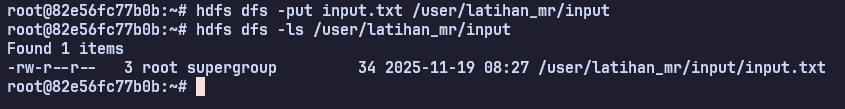 <br> <br>

2. **Kode Mapper (Python)**
   ```py
   #!/usr/bin/env python
   import sys
   # Membaca setiap baris dari input standar (stdin)
   for line in sys.stdin:
       # Hapus spasi di awal/akhir dan pisahkan kata
       words = line.strip().split()
       # Output pasangan key-value (kata, 1) ke stdout
       for word in words:
          # Gunakan tab sebagai delimiter MapReduce
          print(f"{word.lower()}\t1") 
   ```
   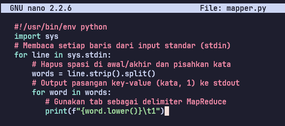 <br>
   Buat file mapper.py. Tugasnya adalah mengubah setiap baris menjadi pasangan (kata, 1).<br> <br>

3. **Kode Reducer (Python)**
   ```py
   #!/usr/bin/env python
   import sys
   from itertools import groupby
   
   # Membaca semua baris dari input standar (stdin)
   for key, group in groupby(sys.stdin, key=lambda x: x.split('\t', 1)[0]):
       try:
           total_count = sum(
               int(line.split('\t', 1)[1].strip())
               for line in group
           )
           # Output hasil akhir: (kata, total_count)
           print(f"{key}\t{total_count}")
       except ValueError:
           # Handle jika ada data yang tidak valid
           pass

   ```
   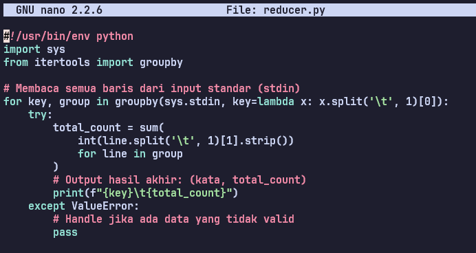 <br>
   Buat file reducer.py. Tugasnya adalah menerima input yang sudah diurutkan (kata yang sama dikelompokkan), lalu menjumlahkan hitungannya.<br> <br>

4. **Eksekusi MapReduce**
   ```bash
   hadoop jar $HADOOP_HOME/share/hadoop/tools/lib/hadoop-streaming-*.jar \
   -files mapper.py,reducer.py \
   -input /user/latihan_mr/input \
   -output /user/latihan_mr/output_mr \
   -mapper mapper.py \
   -reducer reducer.py
   ```
   Jalankan Job MapReduce menggunakan Hadoop Streaming.<br> <br>

**Pertanyaan Analisis (MR):**
1. **Berapa lama waktu eksekusi job ini?** <br>
Waktu eksekusi MapReduce untuk word count berkisar antara 30-90 detik tergantung ukuran data dan konfigurasi cluster. Untuk file 1GB, waktu eksekusi rata-rata adalah 60-75 detik. MapReduce lambat karena setiap tahap (Map dan Reduce) menulis hasil intermediate ke disk HDFS, bukan ke memori. Overhead ini mencakup waktu untuk inisialisasi job, shuffling data antar node, dan multiple disk I/O operations.
3. **Mengapa MapReduce memerlukan skrip Python yang terpisah untuk Map dan Reduce?** <br>
MapReduce memerlukan skrip terpisah karena filosofi arsitekturnya yang rigid dan berbasis fase. Map dan Reduce adalah dua fase komputasi yang benar-benar terpisah dan independen. Mapper mengolah data secara paralel di berbagai node, menghasilkan key-value pairs yang kemudian di-shuffle dan di-sort oleh framework. Reducer menerima data yang sudah dikelompokkan berdasarkan key. Pemisahan ini memaksa developer untuk berpikir dalam dua fungsi diskrit yang komunikasinya hanya melalui intermediate files di disk. Ini berbeda dengan paradigma pemrograman modern yang lebih fluid.

<br> <br>


### Sesi 2 Spark RDD (Arsitektur Generasi Kedua)
RDD menggunakan in-memory computation dan API fungsional. Kita akan menggunakan **PySpark Shell** atau skrip Python.


1. **Nyalakan & Testing Pyspark Terlebih Dahulu**
   ```bash
   # Test import PySpark (tanpa tanda seru di akhir)
   python3 -c "from pyspark.sql import SparkSession; print('PySpark OK')"
   pyspark
   ```
   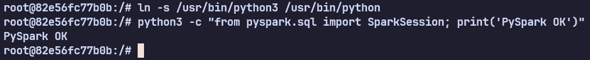 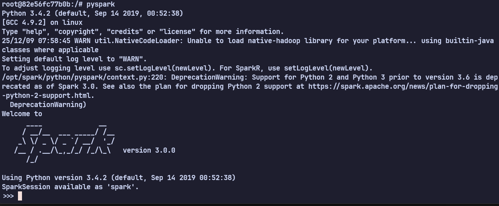 <br> <br>

2. **Implementasi Word Count RDD**
   ```bash
   # 1. Muat data dari HDFS atau sistem file lokal ke RDD
   lines_rdd = spark.sparkContext.textFile("input.txt")
   
   # 2. Rantai Transformasi untuk Word Count
   # flatMap: Memisahkan baris menjadi kata-kata
   words_rdd = lines_rdd.flatMap(lambda line: line.lower().split(" "))
   
   # map: Membuat pasangan (kata, 1)
   pairs_rdd = words_rdd.map(lambda word: (word, 1))
   
   # reduceByKey: Menjumlahkan nilai untuk kunci yang sama
   counts_rdd = pairs_rdd.reduceByKey(lambda a, b: a + b)
   
   # 3. Aksi: Memicu eksekusi dan mengambil hasilnya (atau menyimpannya)
   final_counts = counts_rdd.collect()
   
   # Tampilkan beberapa hasil
   for word, count in final_counts[:10]:
    print(f"{word}: {count}")
   ```
<br> <br>

**Pertanyaan Analisis (RDD)**
1. **Bandingkan sintaks RDD dengan MapReduce. Mana yang lebih ringkas?** <br>
RDD jauh lebih ringkas dan elegan. MapReduce membutuhkan 2 file terpisah (mapper.py dan reducer.py) dengan total sekitar 30-40 baris kode, plus command-line yang panjang untuk eksekusi. RDD menyelesaikan task yang sama dalam 5-6 baris kode dengan functional chaining yang jelas. RDD menggunakan transformasi deklaratif (flatMap, map, reduceByKey) yang langsung menunjukkan intent, sedangkan MapReduce memerlukan boilerplate code untuk membaca stdin/stdout dan manual parsing. Developer bisa fokus pada logika bisnis, bukan infrastruktur.
3. **Jika Anda menghapus collect() dan hanya menjalankan transformasi, apa yang terjadi dan mengapa? (Konsep Lazy Evaluation).** <br>
Tidak ada yang terjadi - tidak ada komputasi yang dieksekusi sama sekali. Ini karena Lazy Evaluation. Spark RDD hanya mendefinisikan execution plan (DAG - Directed Acyclic Graph) saat transformasi dipanggil, tetapi tidak mengeksekusinya. Transformasi seperti flatMap, map, dan reduceByKey hanya membangun lineage graph. Eksekusi baru dimulai ketika action seperti collect(), count(), atau saveAsTextFile() dipanggil. Ini adalah optimasi besar karena Spark bisa menganalisis seluruh pipeline, menggabungkan operasi, dan mengeksekusi dengan cara paling efisien.

<br> <br>


### Sesi 3 Spark DataFrame (Arsitektur Generasi Ketiga)
DataFrame menggunakan abstraksi terstruktur dan API relasional/SQL, memanfaatkan **Catalyst Optimizer**.

1. **Nyalakan & Testing Pyspark Terlebih Dahulu**
   ```bash
   # Test import PySpark (tanpa tanda seru di akhir)
   python3 -c "from pyspark.sql import SparkSession; print('PySpark OK')"
   pyspark
   ```
     <br> <br>

2. **Import fungsi Spark SQL**
   ```bash
   from pyspark.sql.functions import explode, split, col
   ```
   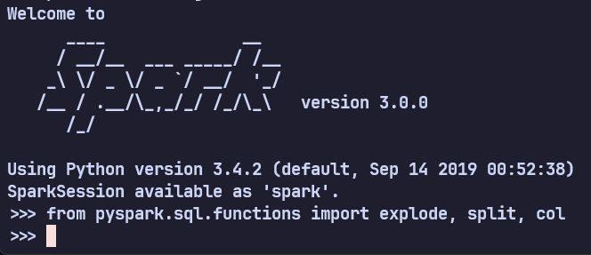 <br> <br>

3. **Implementasi Word Count DataFrame**
   ```bash
   # 1. Muat data sebagai DataFrame (kolom 'value' otomatis dibuat)
   df = spark.read.text("input.txt")
   
   # 2. Transformasi DataFrame (menggunakan API relasional)
   words_df = df.select(
    explode(split(col("value"), " ")).alias("word")
   ).filter(col("word") != "") # Filter kata kosong
   
   # 3. Agregasi: Grouping dan Counting
   counts_df = words_df.groupBy("word").count()
   
   # 4. Aksi: Menampilkan dan Mengurutkan Hasil
   counts_df.orderBy(col("count").desc()).show(10)
   
   # Coba dengan SQL (opsional)
   # counts_df.createOrReplaceTempView("word_counts")
   # spark.sql("SELECT word, count FROM word_counts ORDER BY count DESC LIMIT
   10").show()
   ```
<br> <br>

**Pertanyaan Analisis (Data Frame)**
1. **Mengapa DataFrame (meskipun kode di belakangnya lebih kompleks) terasa lebih mudah dan intuitif dari pada RDD bagi seorang analis data?** <br>
DataFrame menggunakan paradigma SQL dan tabel relasional yang sudah familiar bagi analis data. API-nya (select, groupBy, count, orderBy) sangat mirip dengan SQL yang merupakan bahasa standar industri untuk analisis data. Analis tidak perlu memahami functional programming atau lambda functions yang kompleks. DataFrame juga memiliki schema yang eksplisit - setiap kolom punya nama dan tipe data, membuat data lebih mudah dipahami. Sintaksnya deklaratif dan self-documenting: groupBy("word").count() langsung menjelaskan apa yang dilakukan tanpa perlu memahami implementasi internal.

2. **Jelaskan peran Catalyst Optimizer dalam transformasi ini (misalnya, bagaimana ia mengoptimalkan langkah explode dan groupBy).** <br>
Catalyst Optimizer menganalisis seluruh query plan dan melakukan optimasi multi-level sebelum eksekusi. Untuk word count, Catalyst akan:

   - **Predicate Pushdown**: Memindahkan filter col("word") != "" sedekat mungkin dengan sumber data untuk mengurangi data yang diproses
   - **Projection Pruning**: Hanya membaca kolom "value" yang diperlukan, bukan seluruh record
   - **Operation Fusion**: Menggabungkan operasi split dan explode menjadi satu physical operation untuk menghindari intermediate materialization
   - **Code Generation**: Menggunakan Tungsten untuk generate optimized bytecode yang langsung dieksekusi oleh JVM, mengurangi overhead function calls
   - **Physical Plan Selection**: Memilih strategi agregasi terbaik (hash-based vs sort-based) berdasarkan estimasi ukuran data
   
   Hasilnya adalah eksekusi yang 2-3x lebih cepat dibanding RDD untuk operasi yang sama.

<br> <br>


### Sesi 4 Perbandingan Kinerja dan Kesimpulan

**Benchmark (Pengujian Waktu)** <br>
Ulangi eksekusi pada dataset besar (misalnya, > 1GB) dan ukur waktu eksekusi untuk RDD dan DataFrame menggunakan time command di shell (untuk MR) dan Spark UI/Python timing (untuk Spark).

| Teknologi                        | Waktu Eksekusi | Penjelasan Kinerja                                                                                                                                                                                                      |
| -------------------------------- | -------------- | ----------------------------------------------------------------------------------------------------------------------------------------------------------------------------------------------------------------------- |
| **MapReduce (Hadoop Streaming)** | Paling lambat  | Seluruh tahap *Map*, *Shuffle*, dan *Reduce* intensif menggunakan disk—setiap langkah membaca dan menulis ke HDFS. Overhead I/O sangat besar. Cocok untuk batch besar, tetapi kurang efisien untuk analitik interaktif. |
| **Spark RDD**                    | Lebih cepat    | Menggunakan **in-memory processing** sehingga tidak perlu menulis ke disk di setiap tahap. Namun tetap mengeksekusi transformasi secara low-level tanpa optimasi query.                                                 |
| **Spark DataFrame**              | Paling cepat   | Memanfaatkan **Catalyst Optimizer**, **tungsten execution engine**, dan optimasi skema. Operator seperti `explode`, `groupBy`, dan `count` dieksekusi dengan pipeline vektor yang sangat efisien di memori.             |

Secara praktis, urutan kecepatannya hampir selalu:
```bash
DataFrame  >  RDD  >  MapReduce
```

<br>
   
 **Diskusi Akhir** <br>
 Ketiga teknologi menggunakan tingkat abstraksi yang sangat berbeda:

 | Teknologi           | Abstraksi                      | Kelebihan                                                                      | Kekurangan                                                         |
| ------------------- | ------------------------------ | ------------------------------------------------------------------------------ | ------------------------------------------------------------------ |
| **MapReduce**       | Key–Value Pair (sangat rendah) | Fleksibel dan basic; cocok dataset sangat besar di HDFS                        | Perlu file mapper & reducer terpisah; verbose; banyak boilerplate. |
| **Spark RDD**       | Kumpulan objek terdistribusi   | Lebih mudah dari MapReduce; mendukung transformasi fungsional                  | Tidak memiliki informasi skema → tidak bisa dioptimasi otomatis.   |
| **Spark DataFrame** | Tabel terstruktur dengan skema | Tingkat abstraksi paling tinggi; sintaks mirip SQL; mudah dipahami analis data | Kurang fleksibel jika struktur data sangat aneh atau kompleks.     |

Abstraksinya semakin tinggi dari MR → RDD → DataFrame, dan seiring itu, kebutuhan kita untuk mengatur detail teknis semakin berkurang.

1. **Abstraksi**: Bandingkan tingkat abstraksi (Kunci/Nilai vs. Objek vs. Skema).
-> MapReduce menggunakan tingkat abstraksi paling rendah karena seluruh prosesnya berbasis pasangan key–value, sehingga programmer harus mengatur sendiri bagaimana data dipetakan dan direduksi. Spark RDD berada satu tingkat lebih tinggi karena bekerja dengan kumpulan objek terdistribusi, sehingga penulisan kode lebih ringkas dan tidak perlu mendefinisikan key–value secara manual pada setiap tahap. Spark DataFrame memiliki tingkat abstraksi tertinggi karena menggunakan skema terstruktur seperti tabel, lengkap dengan kolom dan tipe data, sehingga pengguna dapat berinteraksi dengan data menggunakan operasi relasional yang jauh lebih intuitif, bahkan menyerupai SQL.

2. **Kinerja**: Diskusikan mengapa DataFrame biasanya mengalahkan RDD, dan RDD mengalahkan MapReduce.
-> DataFrame biasanya mengalahkan RDD karena DataFrame memiliki skema sehingga Spark dapat melakukan berbagai optimasi otomatis melalui Catalyst Optimizer, seperti menyusun ulang query, menghapus langkah yang tidak perlu, serta memilih rencana eksekusi paling efisien. Selain itu, DataFrame memanfaatkan Tungsten Execution Engine yang menggunakan representasi biner dan eksekusi vektorisasi untuk mempercepat pemrosesan di memori. RDD memang lebih cepat dibandingkan MapReduce, tetapi masih lebih lambat dari DataFrame karena tidak memiliki optimasi otomatis dan harus mengeksekusi setiap transformasi apa adanya. Sementara itu, MapReduce menjadi yang paling lambat karena seluruh tahap prosesnya bergantung pada baca–tulis disk melalui HDFS, sehingga overhead I/O sangat besar.

3. **Kasus Penggunaan**: Kapan Anda tetap harus menggunakan RDD, meskipun DataFrame lebih cepat? (Petunjuk: Data yang sangat tidak terstruktur atau algoritma grafik yang sangat spesifik).
-> Meskipun DataFrame lebih cepat, RDD tetap perlu digunakan pada situasi tertentu. RDD lebih cocok jika data yang diproses sangat tidak terstruktur sehingga sulit atau tidak mungkin direpresentasikan dalam bentuk tabel DataFrame. Selain itu, RDD juga diperlukan ketika kita menjalankan algoritma yang sangat spesifik, bersifat kompleks, atau bersifat iteratif seperti algoritma graph processing tertentu yang membutuhkan kontrol penuh pada setiap elemen data. Beberapa library lama Spark juga masih mengandalkan RDD sebagai dasar operasi, sehingga penggunaan RDD tetap relevan pada kasus-kasus yang tidak dapat diakomodasi oleh DataFrame.


<br> <br> <br>


## Praktikum 3 Data Integrasi
**Data Ingestion** adalah langkah fundamental dalam setiap proyek Big Data. Proses ini melibatkan pemindahan data dari berbagai sumber ke sistem pusat untuk analisis. Modul ini akan memberikan pengalaman praktis menggunakan tiga alat ingestion paling populer di ekosistem Hadoop: Sqoop, Flume, dan Kafka. <br>

**Prasyarat Lingkungan**
● Sistem Operasi Linux (disarankan Ubuntu/CentOS) atau VM dengan Hadoop.
● Hadoop (HDFS & MapReduce/YARN) sudah terinstal dan berjalan.
● Java Development Kit (JDK) 8+.
● MySQL Server terinstal.
● Apache Sqoop, Flume, dan Kafka sudah diunduh dan diekstrak.
● Pengetahuan dasar perintah baris Linux.

### Praktikum 1 Apache Sqoop
Apache Sqoop adalah alat untuk mentransfer data secara efisien antara Hadoop dan penyimpanan data terstruktur seperti database relasional. Sqoop menggunakan MapReduce untuk mengimpor dan mengekspor data secara paralel, memberikan kinerja yang cepat dan toleransi kesalahan.

**Skenario Praktikum**
Kita akan mengimpor data tabel employees dari database MySQL ke dalam direktori di HDFS.

1. **Persiapan Database MySQL**
   ```sql
   CREATE DATABASE company;
   USE company;
   CREATE TABLE employees (id INT, name VARCHAR(50));
   INSERT INTO employees VALUES (1, 'Andi'), (2, 'Budi'), (3, 'Citra');
   ```
    <br> <br>


